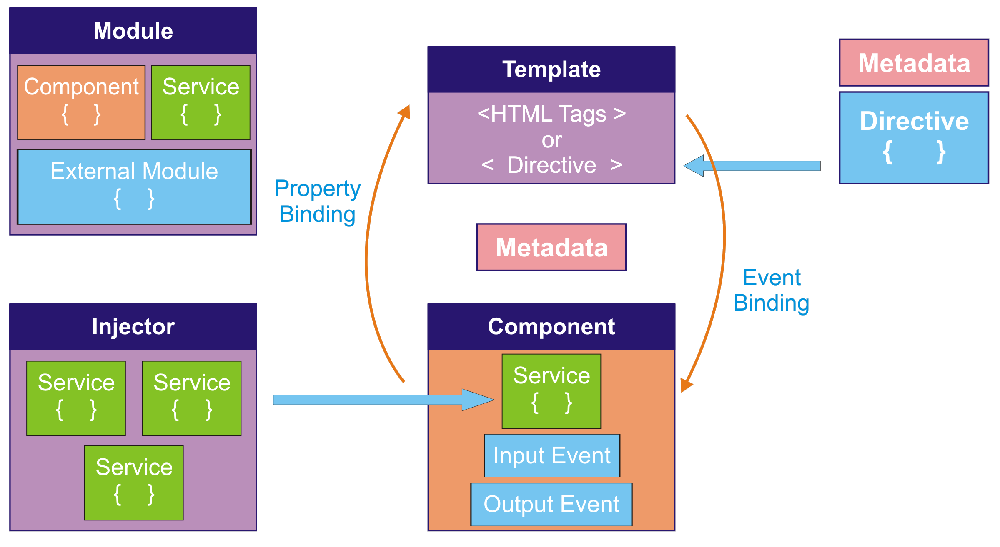

# Arquitetura Angular

    

## Module
Todas as aplicações do angular podem ser compostas por diversos módulos, que são carregados a medida que os componentes são carregados. Um módulo é compreendido pelo nome do arquivo sem a sua extensão.

## Component
Um componente no Angular é qualquer parte visual da sua aplicação. Na maioria das vezes, um componente possui o decorator @Component, que contém informações sobre o componente como a sua diretiva, o template, o estilo css e outras.

## Template
Uma parte importante do componente é o template, que define como ele será desenhado na aplicação. Um template possui código HTML, diretivas, chamada a eventos e também outros templates.

## Data Binding
Uma propriedade no componente pode ser ligada a um evento ou método do componente.

## Metadata
Os metadados são usados para fornecer informações a uma classe, no caso do Angular são usados decorators.

## Directive
Uma parte importante do componente é o template, que define como ele será desenhado na aplicação. Um template possui código HTML, diretivas, chamada a eventos e também outros templates.

## Service
Uma classe service tem como responsabilidades prover dados, sejam eles vindo de um servidor ou não. Na verdade a classe service é uma classe TypeScript comum, mas que possui apenas o conceito de manipulação de dados.

## Dependency Injection
O conceito de injeção de dependência não é proveniente do Angular 2, mas sim da orientação a objetos. O Angular usa este conceito para facilitar a instanciação de classes pelos componentes, de forma a prover a instância da classe automaticamente.

Uma classe “injetada” fica disponível globalmente à aplicação. Ou seja, se alteramos a propriedade de uma classe que está injetada, esta alteração continuará ativa se a classe for injetada em outro lugar.

