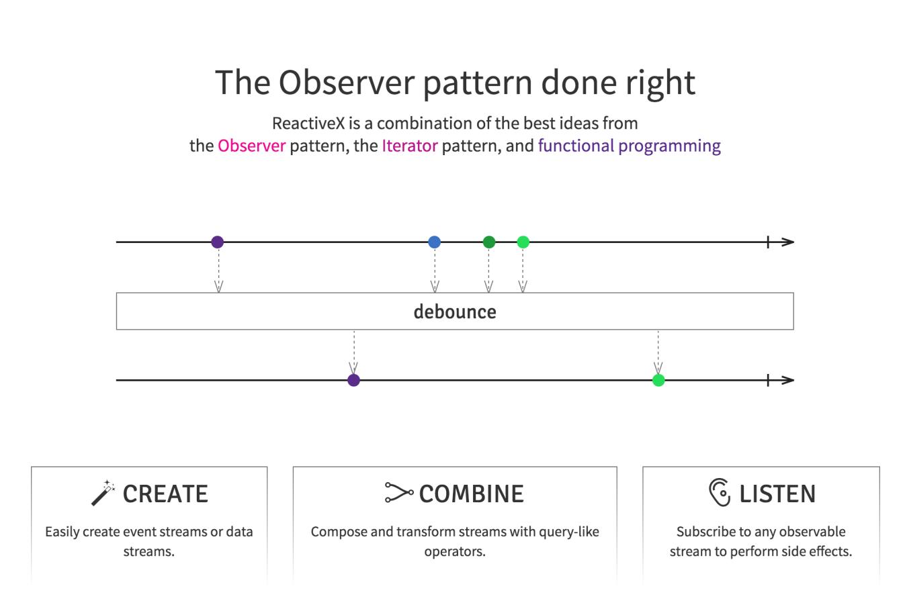
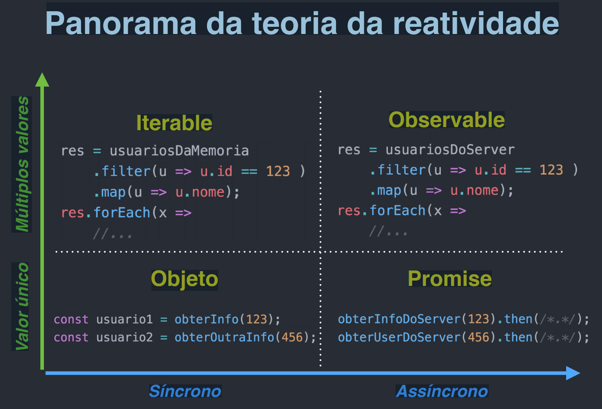

# Angular - Padrão Observer

<p align="center">
    
</p>

## Panorama da reatividade

<p align="center">
    
</p>

## Angular reativo

* Forms
* Routing
* Http Service
* Pipe

### Projeto Original: https://github.com/Reactive-Extensions/RxJS

### Reescrita: https://github.com/ReactiveX/rxjs

(melhor performance, modularidade, pilha de debug/
depuração => boa compatibilidade com versões anteriores,
com poucas breaking changes)

## Exemplo 1

```javascript

    ...

    constructor(
        private postService: PostService
    ) {}

    listAll() {
        this.postService.listAll().subscribe(d2 => this.setPosts( d2 as Array<Post> ));
    }
    
    ...

    export class PostService {
        public listAll() {
            return this.http.get<T[]>(`${this.url}/${this.endpoint}`)
                .pipe(
                    /* tap( _ => this.log(`List All...`)) */,
                    catchError(this.handleError<T[]>('Erro Busando...', []))
                );
        }
    }
```

## Exemplo 2

Exemplo de programação reativa com a rxjs:


```javascript

@Component({
  selector: 'app-root',
  template: `<input type="text" [formControl]  ="myInput">
              <ul>
                <li *ngFor="let r of result | async "> {{ r?.name }}</li>
                 <!-- async faz subscricao e cancela observable -->
              </ul> `
})
export class AppComponent {
  myInput = new FormControl;
  result = from([])
      .pipe( // versão 6.0 rxjs operações são encadeados com pipe
        merge( this.myInput.valueChanges) , // pega input e combina com array inicial
        filter( v => v.length > 1 ) , // filtra tamanho da sequenc de caraters para buscar somente maior que 1
        debounceTime( 300 ) , // tempo de espera, evita flodar api ( tempo de espera para próximo evento )
        map( v => `https://swapi.co/api/people/?search=${v}`) , // pega resposta do request
        switchMap( url => this.http.get(url)) , // cancela subscrições anteriores
        map( json => json['results']), // map para json
        retry(3), // número de tentativas
      );

```

Para objetos faça:

```javascript

   <sectioin *ngIf="userResult | async as user">
      {{ user.name }}
      {{ user.age }}
      {{ user.email }}
    </section>

```

## Referências

https://rxmarbles.com/

https://www.learnrxjs.io/

https://ngrx.io/guide/store