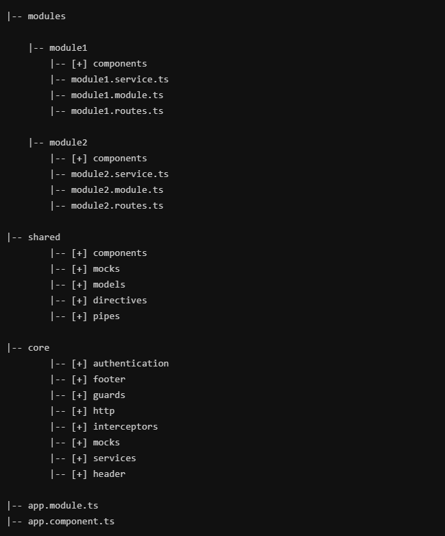
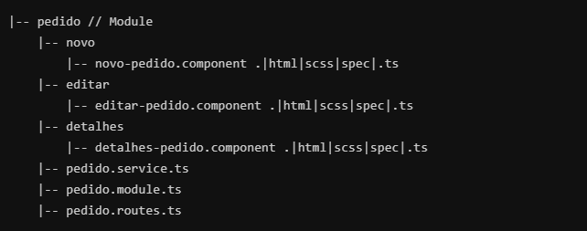

# Arquitetura Angular

## Por que estruturar as pastas do projeto Web?
Melhores práticas trazem benefícios concretos para a empresa. Seguir uma boa prática é como um atalho. Existem outros caminhos. Às vezes não sabemos o porquê do atalho. Mas seguir por ele aumenta as chances de sucesso. Os benefícios a longo prazo trazem ganhos na qualidade do software.

## Escalabilidade
O código será mais simples escalar. Adicionar novos componentes, módulos e páginas não provoca inchaço as pastas existentes. Mantém a complexidade do sistema baixo. Logo a integração de novos desenvolvedores será uma tarefa tranquila. Além disso, com essa abordagem, é relativamente simples descartar recursos dentro e fora do aplicativo. Testar uma nova funcionalidade ou removê-la será fácil.

## Debugar
Debugar o código será mais transparente com essa abordagem modularizada. Manter uma estrutura coesa traz benefícios para encontrar bugs e corrigi-los.

## Um jeito diferente do cli
Não existem balas de prata ao tentar criar uma estrutura de pastas eficientes para Angular. Vai depender das funcionalidades e do tamanho do projeto. A estrutura vai mudar muito dependendo do projeto. Este artigo vai propor e explicar o cenário de um projeto estruturado em módulos. Com componentes e shared services.

## A estrutura
Abaixo a estrutura proposta para projetos de grande porte

    

## Módulos - Lazy Load
Módulos lazy loaded ajudam a diminuir o tempo de inicialização da aplicação. Com o lazy load, o aplicativo não precisa carregar tudo de uma só vez. Ele só vai carregar o que o usuário espera ver. O módulo só irá carregar quando o usuário navegar para sua rota. Perfeito para aplicações grande, combina com o interesse do usuário e organiza a estrutura. Todo o conteúdo do módulo está diretamente relacionado com a rota. Logo faz sentido os componentes estarem dentro do módulo.

    

Trabalhar com módulos há ganhos significativos na inicialização da aplicação. É inimaginável uma aplicação Angular de médio porte sem módulos lazy load. E essa estrutura é coesa, mantém os grupos de interesse dentro de um mesmo local.

## Core
O core module deve conter serviços singleton, componentes universais e outros recursos em que há uma instância única. Autenticação, header, interceptors são exemplos de componentes que terá apenas uma instância ativa para a aplicação e será utilizado praticamente por todos os modules.

## Shared
O shared é onde todos os componentes compartilhados, pipes, filters e services devem ir. O shared pode ser importado em qualquer module. Assim esses itens serão reutilizados. O shared module deve ser independente do restante do aplicativo. Portanto, não deve ter referências de outro módulo.

## Conclusão
Não há balas de prata a respeito de estruturas de pastas do Angular, isso depende do tamanho e objetivo da aplicação. Este artigo foi criado para abordar uma estrutura de pasta da versão 5 do Angular, no entanto a versão 6 que saiu essa semana, 20/05/2018, não houve grandes modificações que comprometem a abordagem.

## Referencia

https://www.brunobrito.net.br/estruturando-components-angular/
